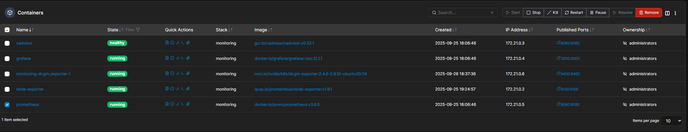
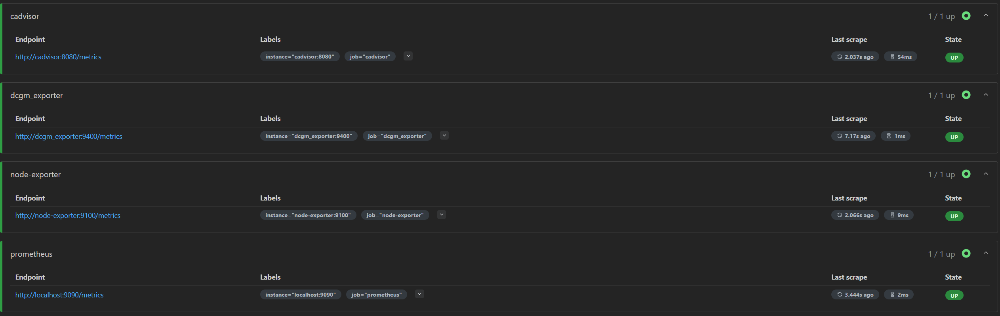
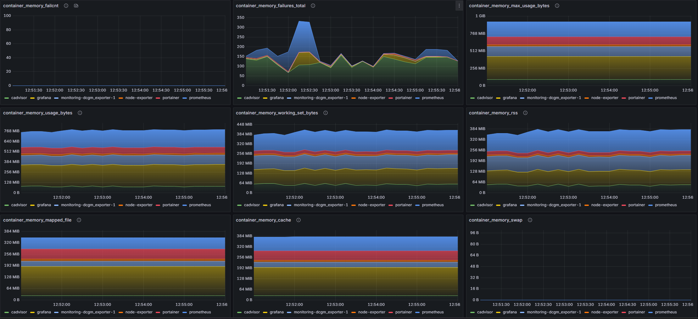
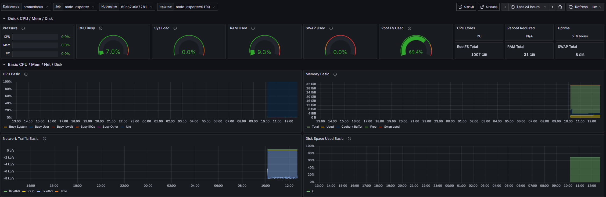
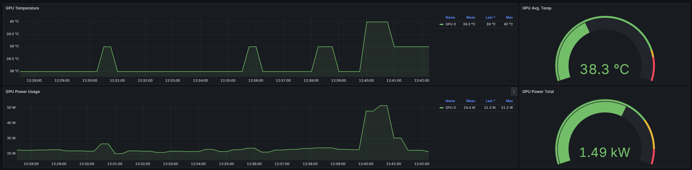

# 🚀 Docker Monitoring Stack with Prometheus & Grafana

A complete monitoring solution for Docker environments with GPU support, featuring Prometheus, Grafana, and multiple exporters for comprehensive system and container metrics.

## 📋 Table of Contents

- [Overview](#overview)
- [Prerequisites](#prerequisites)
- [Installation](#installation)
- [Configuration](#configuration)
- [Grafana Dashboards](#grafana-dashboards)
- [Accessing Services](#accessing-services)
---

## Overview

This monitoring stack provides:

- **Portainer** - Docker container management UI
- **Prometheus** - Metrics collection and time-series database
- **Grafana** - Visualization and dashboards
- **cAdvisor** - Container resource usage metrics
- **Node Exporter** - Host system metrics (CPU, memory, disk, network)
- **DCGM Exporter** - NVIDIA GPU metrics (optional)


---

## Prerequisites

Ensure the following are installed on your system:

### Required
- **Docker** (v20.10+)
- **Docker Compose** (v2.0+)

### Optional (for GPU monitoring)
- **NVIDIA Container Toolkit**
  
  📖 [Installation Guide](https://docs.nvidia.com/datacenter/cloud-native/container-toolkit/latest/install-guide.html)

### Recommended
- **Portainer CE** - For easier Docker management
  
  📖 [Installation Guide](https://docs.portainer.io/start/install-ce/server/docker/linux#deployment)

---

## Installation

### Step 1: Clone or Download Repository

Ensure you have the following files:
- `docker-compose.yaml`
- `.env.prod`
- `prometheus.yml`

### Step 2: Deploy with Portainer

1. Access Portainer at `https://localhost:9443`
2. Navigate to **Stacks** section
3. Click **Add stack**
4. Choose one of:
   - Upload `docker-compose.yaml` file
   - Copy and paste the YAML content directly
5. Add environment variables from `.env.prod` in the **Environment variables** section
6. Click **Deploy the stack**

### Step 3: Optional - check your deployed stack via Portainer

```bash
$ docker ps --filter "label=com.docker.compose.project=YOUR-STACK-NAME"

CONTAINER ID   IMAGE                                                       COMMAND    CREATED     STATUS     PORTS                                         NAMES
4226f778802e   nvcr.io/nvidia/k8s/dcgm-exporter:2.4.6-2.6.10-ubuntu20.04   .....      Up 3 hours             0.0.0.0:9400->9400/tcp, [::]:9400->9400/tcp   monitoring-dcgm_exporter-1
69cb739a7781   quay.io/prometheus/node-exporter:v1.9.1                     .....      Up 3 hours             0.0.0.0:9100->9100/tcp, [::]:9100->9100/tcp   node-exporter
7dbbc6e13722   gcr.io/cadvisor/cadvisor:v0.52.1                            .....      Up 3 hours  (healthy)  0.0.0.0:8080->8080/tcp, [::]:8080->8080/tcp   cadvisor
f9c6b901b16e   grafana/grafana-oss:12.1.1                                  .....      Up 3 hours             0.0.0.0:3000->3000/tcp, [::]:3000->3000/tcp   grafana
cdc610430c7d   prom/prometheus:v3.6.0                                      .....      Up 3 hours             0.0.0.0:9090->9090/tcp, [::]:9090->9090/tcp   prometheus
```

---

## Configuration

### Configure Prometheus

Prometheus needs to be configured to scrape metrics from all exporters.

1. **Copy the Prometheus configuration:**

```bash
sudo cp prometheus.yml /etc/prometheus/prometheus.yml
```

2. **Verify the configuration:**

```yaml
# prometheus.yml example structure
scrape_configs:
  - job_name: 'prometheus'
    static_configs:
      - targets: ['localhost:9090']

  - job_name: 'node-exporter'
    static_configs:
      - targets: ['node-exporter:9100']

  - job_name: 'cadvisor'
    static_configs:
      - targets: ['cadvisor:8080']

  - job_name: 'dcgm-exporter'
    static_configs:
      - targets: ['dcgm-exporter:9400']
```

3. **Restart Prometheus:**



### Verify Metrics Endpoints

Test each exporter's metrics endpoint:

```bash
# cAdvisor (container metrics)
curl http://localhost:8080/metrics

# Node Exporter (host metrics)
curl http://localhost:9100/metrics

# DCGM Exporter (GPU metrics)
curl http://localhost:9400/metrics

# Prometheus (self-monitoring)
curl http://localhost:9090/metrics
```

### Check Prometheus Targets

1. Open `http://localhost:9090/targets`
2. Verify all targets show **UP** status (green)
3. If any target is **DOWN**, check:
   - Container is running: `docker ps`
   - Logs: `docker logs <container-name>`
   - Network connectivity between containers


---

## Grafana Dashboards

### Access Grafana

1. Navigate to `http://localhost:3000`
2. Default credentials:
   - **Username:** `admin`
   - **Password:** `admin` (change on first login)

### Add Prometheus Data Source

1. Go to **connections** → **Data Sources**
2. Click **Add new data source**
3. Select **Prometheus**
4. Set URL: `http://prometheus:9090`
5. Click **Save & Test**

### Import Pre-built Dashboards

Import these community dashboards for instant monitoring:

| Exporter | Dashboard | ID | Import URL |
|----------|-----------|-----|-----------|
| **cAdvisor** | Container Monitoring | 19792 | [View Dashboard](https://grafana.com/grafana/dashboards/19792-cadvisor-dashboard/) |
| **Node Exporter** | System Monitoring | 1860 | [View Dashboard](https://grafana.com/grafana/dashboards/1860) |
| **DCGM Exporter** | NVIDIA GPU Monitoring | 12239 | [View Dashboard](https://grafana.com/grafana/dashboards/12239-nvidia-dcgm-exporter-dashboard/) |

#### How to Import:

1. In Grafana, click **+** → **Import**
2. Enter the Dashboard ID (e.g., `1860`)
3. Click **Load**
4. Select your Prometheus data source
5. Click **Import**

---

## Accessing Services

| Service | URL | Purpose |
|---------|-----|---------|
| Portainer | `https://localhost:9443` | Docker management UI |
| Prometheus | `http://localhost:9090` | Metrics database & query UI |
| Grafana | `http://localhost:3000` | Dashboards & visualizations |
| cAdvisor | `http://localhost:8080/metrics` | Containers metrics endpoint |
| Node Exporter | `http://localhost:9100/metrics` | Host metrics endpoint |
| DCGM Exporter | `http://localhost:9400/metrics` | GPU metrics endpoint |

---
## Some beautiful dashboards captured from Grafana:




---
